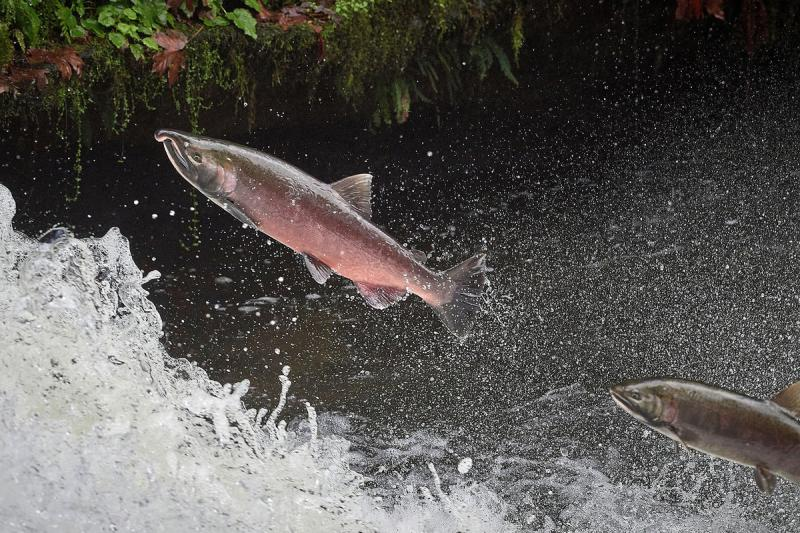
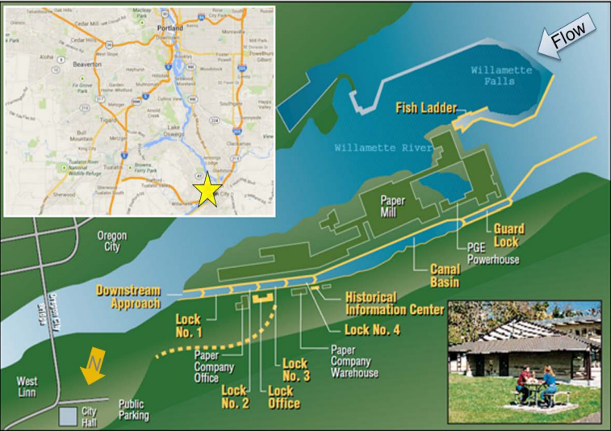

# Overview {.tabset}

This report will explore fish passage data from 2001-01-01 to 2010-12-31 at the Willamette Falls fish ladder in Oregon. Data were shared and accessed from Columbia River DART. The Oregon Department of Fish and Wildlife (ODFW) mans a station at the falls where fish counts are recorded every day, 24 hours a day. This report will specifically look at time series, seasonal plots, and total counts for steelhead, coho, and coho jack salmon. 

**Data Citation:** Columbia Basin Research, University of Washington. 2023. DART Adult Passage Graphics & Text. [<http://www.cbr.washington.edu/dart/query/adult_graph_text.>](http://www.cbr.washington.edu/dart/query/adult_graph_text.)






## Setup 

```{r setup, message = FALSE, warning = FALSE}
knitr::opts_chunk$set(echo = TRUE, warning = FALSE, message = FALSE)

### attach packages
library(here)
library(tidyverse)
library(janitor)
library(lubridate)
library(tsibble)
library(feasts)
library(fable)
library(cowplot)

### read in data
fish <- read_csv(here("data", "willamette_fish_passage.csv")) %>%
  replace(is.na(.), 0) %>%
  clean_names() %>% 
  select("date", "coho", "jack_coho", "steelhead")


### have R read date as date, make it a tibble
fish_ts <- fish %>% 
  mutate(date = mdy(date)) %>% 
  as_tsibble(key = NULL, index = date)


```

## Original time series

```{r}
### want to make a plot with date on x axis and count of fish on y, so cleaning up the rows to do that
fish_longer<- fish_ts %>%
  pivot_longer(cols = 2:4, names_to = "species", values_to = "count") %>% 
    mutate(species = case_when(
    species == "coho" ~ "Coho",
    species == "jack_coho" ~ "Jack Coho", 
    species == "steelhead" ~ "Steelhead"))

### make the plot
ggplot(data = fish_longer, aes(x = date, y = count, color = species))+
  geom_line(size = 0.5, alpha = 0.9)+
  theme_minimal()+
  labs(x = "Date",
       y = "Number of fish",
       title = "Number of Salmon at Willemette Falls Fish Passage",
       subtitle = "2001-01-01 to 2010-12-31")+
  scale_color_manual(values = c("darkgreen", "salmon", "darkgray"))
```

**Figure 1.** Time series plot displaying total fish counts by date and species from January 1, 2001 to December 31, 2010. The three colors represent fish species steelhead, coho, and jack coho salmon. 

-  Steelhead salmon have the most consistent population counts and seasonal trends.
- In 2009 and 2010, coho salmon counts drastically increased.
- Coho and jack coho have similar seasonality patterns while steelhead seem to pass through Willamette Falls at a different time.

## Seasonplots

```{r}
# organize by month for better visualization

fish_longer %>% 
  gg_season(y = count, 
            pal = c("darkgreen", "salmon", "darkgray")) +
  theme_minimal() +
  labs(x = element_blank(), y = "Daily Fish Count",
       title = "Daily Count of Fish at Willemette Falls Fish Passage",
       subtitle = "2001-01-01 to 2010-12-31")
```

**Figure 2.** Seasonplot displaying daily counts for coho, jack coho, and steelhead salmon swimming through the Willemette Falls fish passage from January 1, 2001 to December 31, 2010.

- Coho and jack coho species both pass through the falls around October, and not during any other time of the year.
- Steelhead salmon are present at the falls throughout most of the year, but peak in the late spring/summer months.

## Annual Counts by Species
```{r}
### wrangle date to get counts by year and species
fish_longer_annual <- fish_longer %>% 
   index_by(year = ~year(.)) %>% 
  group_by(year, species) %>% 
  summarize(annual_count = sum(count))


### plot
ggplot(data = fish_longer_annual, aes(x = year, y = annual_count, color = species))+
  geom_line(size = 0.75)+
  theme_minimal()+
  scale_x_continuous(n.breaks = 10)+
  labs(x = "Year", y = "Annual Count", 
       title = "Annual Counts of Salmon at Willemette Falls Fish Passage",
       subtitle = "2001-01-01 to 2010-12-31")+
  scale_color_manual(values = c("darkgreen", "salmon", "darkgray"))
```

**Figure 3.** Annual counts of coho, jack coho, and steelhead salmon passing through Willemette Falls from 2000-2010. 

- The annual count of steelhead greatly outnumbers the total amount of coho and jack coho, up until 2009.
- In 2009, the number of coho salmon drastically increases while the number of steelhead levels off a bit after fluctuating yearly in 2001-2005.
- Jack coho salmon have the lowest count numbers throughout the majority of time from 2001-2010. 

