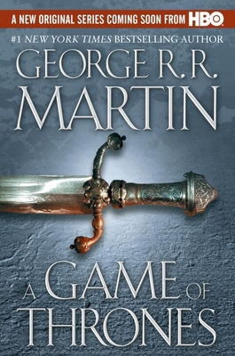

# Overview
This report works through a sentiment analysis of the novel *A Game of Thrones*, the first volume in the incredibly popular fantasy series *A Song of Ice and Fire* (Dario, 2022). First, I analyze the most frequently used words throughout the book, then I visualize a sentiment analysis using the NRC lexicon, which assigns words to sentiment bins based on emotion (Mohammed & Turney, 2013).  

]

```{r setup, warning = FALSE, message = FALSE}
knitr::opts_chunk$set(echo = TRUE, warning = FALSE, message = FALSE)

library(tidyverse)
library(tidytext)
library(textdata)
library(pdftools)
library(ggwordcloud)

```

```{r}
### Get GoT
got_text <- pdf_text(here::here('data', 'GoT.pdf'))

### want to see text from a single page
# got_p34 <- got_text[34]
# got_p34
```


```{r}
### make it a df
got_lines <- data.frame(got_text) %>% 
  mutate(page = 1:n()) %>%
  mutate(text_full = str_split(got_text, pattern = '\\n')) %>% 
  unnest(text_full) %>% 
  mutate(text_full = str_trim(text_full))
```

```{r}
### add new column that contains chapter by using character name
got_tidy <- got_lines %>%
  slice(-(1:106)) #%>%

```

```{r}
### word counts for whole book
got_words <- got_tidy %>% 
  unnest_tokens(word, text_full) %>% 
  select(-got_text)

got_wordcount <- got_words %>% 
  count(word)
```


```{r}
### remove stop words
got_words_clean <- got_words %>% 
  anti_join(stop_words, by = 'word')

### count again
nonstop_counts <- got_words_clean %>% 
  count(word)

### top 10 words in whole book
top_10_words <- nonstop_counts %>% 
  arrange(-n) %>% 
  slice(1:10)
```

```{r}
### word count visualizations
ggplot(data = top_10_words, aes(x = n, y = reorder(word, -n))) +
  geom_col(fill = "darkslategray")+
  labs(x = "Count", y = "Word", title = "Top 10 Most Frequently Used Words in" ~italic("A Game of Thrones"))
```

**Figure 1.** Top 10 most frequently used words in the book *A Game Of Thrones*. Stop words such as a, and, the, and about were removed to focus on more relevant words. 

```{r}
### word count for top 100 words in whole book
got_top100 <- nonstop_counts %>% 
  arrange(-n) %>% 
  slice(1:100)

got_cloud <- ggplot(data = got_top100, aes(label = word)) +
  geom_text_wordcloud(aes(color = n, size = n), shape = "diamond") +
  scale_size_area(max_size = 6) +
  scale_color_gradientn(colors = c("darkslategray","orange","gold")) +
  theme_minimal()

got_cloud
```

**Figure 2.** *A Game of Thrones* top 100 most frequently used words. Stop words such as a, and, the, and about were removed.

```{r}
### sentiment analysis using nrc lexicon
nrc_lex <- get_sentiments(lexicon = "nrc")

### bind got data to nrc
got_nrc <- got_words_clean %>% 
  inner_join(get_sentiments("nrc"))

### get count by sentiment bin
got_nrc_counts <- got_nrc %>% 
  count(sentiment)

ggplot(data = got_nrc_counts, aes(x = n, y = reorder(sentiment, -n), fill = sentiment))+
  scale_fill_manual(values=c("anticipation" = "gold",
                             "joy" = "gold",
                             "positive" = "gold",
                             "trust" = "gold",
                             "surprise" = "gold",
                             "sadness" = "darkslategray",
                             "disgust" = "darkslategray",
                             "anger" = "darkslategray",
                             "negative" = "darkslategray",
                             "fear" = "darkslategray"))+
  geom_col()+
  labs(x = "Count", y = "Sentiment", title = "Sentiment Analysis of" ~italic("A Game of Thrones"))+
  theme_minimal()+
  theme(legend.position = "none")

```

**Figure 3.** Sentiment analysis using nrc lexicon for *A Game of Thrones*. Yellow bars indicate more positive emotions and the dark gray indicate negative emotions.


# Citation

**Data Citation:** Dario. (2022, October 15). A game of thrones. Reading Sanctuary. Retrieved March 13, 2023, from https://www.readingsanctuary.com/read-online/1-game-of-thrones-book-pdf 

**Citation for NRC lexicon**: Crowdsourcing a Word-Emotion Association Lexicon, Saif Mohammad and Peter Turney, Computational Intelligence, 29 (3), 436-465, 2013.